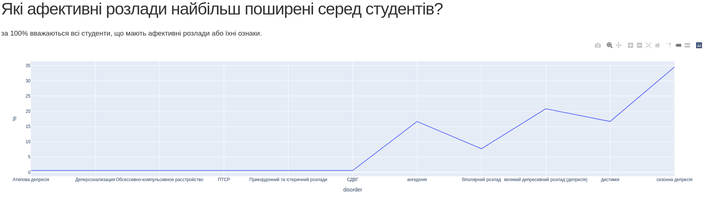

# UCU Semester Project
## Analysis of depressive and anxiety disorders' impact on suicide rates for different age groups

### Description
#### This project includes
* analysis of data from the open sources
* analysis of results of Google Forms created by me
* visualisation of the described data

#### The visualisation provided
* dependence of number of suicides on age for years 1991-2017
* dependence of number of people with anxiety disorders on year for each country
* dependence of number of people with depressive disorders on year for each country
* dependence of number of people with depressive disorders worldwire on year
* dependence of average age of suicide on year
* how many students practice(d) selfharm
* how many stidents change their behavior and plans due to anxiety
* how many students think that studying negatively affected their mental health
* how many students have(had) suicidal thougths
* dependence of number of students with suicide attempts on age
* dependence of number of students who visited doctors on age
* the most common anxiety disorders
* the most common depressive disorders
* dependence of number of students with depressive disorders on age
* how many students with depressive disorders have been diagnosed
* how many students with anxiety disorders have been diagnosed

***
### Aim and usage
This project's aim is to attract people's attention to the mental health problems both in Ukraine and abroad.
Especially I want to emphasize issues with teenagers and students.

To launch and run web application, run module analysis.py, which is the main module of the program.

When web app launches, in requests information from the Googhe Spreadsheets usin Google Sheets API.

To open application, click on the link in terminal after running main module. (it launches only locally)

***
### Contents
* [modules](https://github.com/sophmintaii/UCU_2term_homework/tree/master/modules)
  * [responselist.py](https://github.com/sophmintaii/UCU_2term_homework/blob/master/modules/responselist.py) - contains ADT implementation.
  * [people.py](https://github.com/sophmintaii/UCU_2term_homework/blob/master/modules/people.py) - contains implementation of Person and Student classes.
  * [agegroup.py](https://github.com/sophmintaii/UCU_2term_homework/blob/master/modules/agegroup.py) - contains implementation of AgeGroup class.
  * [studentgroup.py](https://github.com/sophmintaii/UCU_2term_homework/blob/master/modules/studentgroup.py) -  contains implementations of StudentGroup class.
  * [psyanalyser.py](https://github.com/sophmintaii/UCU_2term_homework/blob/master/modules/psyanalyser.py) - comtains implementation os PsyAnalyser class.
  * [psystudentanalyser.py](https://github.com/sophmintaii/UCU_2term_homework/blob/master/modules/psystudentanalyser.py) - contains implementation of PsyStudentAnalyser class.
  * [analysis.py](https://github.com/sophmintaii/UCU_2term_homework/blob/master/modules/analysis.py) - the main module of the program, where data analysis and web page creation happen.

* [examples](https://github.com/sophmintaii/UCU_2term_homework/tree/master/examples)
  * [example_google_sheets.py](https://github.com/sophmintaii/UCU_2term_homework/blob/master/examples/example_google_sheets.py) - example of Google Sheets API usage.
  * [example_libraries.py](https://github.com/sophmintaii/UCU_2term_homework/blob/master/examples/example_libraries.py) - example of Pandas, Plotly and Dash libraries usage.
  [example_adt.py](https://github.com/sophmintaii/UCU_2term_homework/blob/master/examples/example_adt.py) - example of ResponseList ADT usage.

***
### Wiki contents
* [Homework #0 results](https://github.com/sophmintaii/UCU_2term_homework/wiki/1.-%D0%A0%D0%B5%D0%B7%D1%83%D0%BB%D1%8C%D1%82%D0%B0%D1%82%D0%B8-%D0%B2%D0%B8%D0%BA%D0%BE%D0%BD%D0%B0%D0%BD%D0%BD%D1%8F-%D0%B4%D0%BE%D0%BC%D0%B0%D1%88%D0%BD%D1%8C%D0%BE%D0%B3%D0%BE-%D0%B7%D0%B0%D0%B2%D0%B4%D0%B0%D0%BD%D0%BD%D1%8F-%E2%84%960)

* [Homework #1 results](https://github.com/sophmintaii/UCU_2term_homework/wiki/2.-%D0%A0%D0%B5%D0%B7%D1%83%D0%BB%D1%8C%D1%82%D0%B0%D1%82%D0%B8-%D0%B2%D0%B8%D0%BA%D0%BE%D0%BD%D0%B0%D0%BD%D0%BD%D1%8F-%D0%B4%D0%BE%D0%BC%D0%B0%D1%88%D0%BD%D1%8C%D0%BE%D0%B3%D0%BE-%D0%B7%D0%B0%D0%B2%D0%B4%D0%B0%D0%BD%D0%BD%D1%8F-%E2%84%961)

* [Homework #2 results](https://github.com/sophmintaii/UCU_2term_homework/wiki/3.-%D0%A0%D0%B5%D0%B7%D1%83%D0%BB%D1%8C%D1%82%D0%B0%D1%82%D0%B8-%D0%B2%D0%B8%D0%BA%D0%BE%D0%BD%D0%B0%D0%BD%D0%BD%D1%8F-%D0%B4%D0%BE%D0%BC%D0%B0%D1%88%D0%BD%D1%8C%D0%BE%D0%B3%D0%BE-%D0%B7%D0%B0%D0%B2%D0%B4%D0%B0%D0%BD%D0%BD%D1%8F-%E2%84%962)

* [Homework #3  results](https://github.com/sophmintaii/UCU_2term_homework/wiki/3.-%D0%A0%D0%B5%D0%B7%D1%83%D0%BB%D1%8C%D1%82%D0%B0%D1%82%D0%B8-%D0%B2%D0%B8%D0%BA%D0%BE%D0%BD%D0%B0%D0%BD%D0%BD%D1%8F-%D0%B4%D0%BE%D0%BC%D0%B0%D1%88%D0%BD%D1%8C%D0%BE%D0%B3%D0%BE-%D0%B7%D0%B0%D0%B2%D0%B4%D0%B0%D0%BD%D0%BD%D1%8F-%E2%84%963)

* [Homework #4  results](https://github.com/sophmintaii/UCU_2term_homework/wiki/4.-%D0%A0%D0%B5%D0%B7%D1%83%D0%BB%D1%8C%D1%82%D0%B0%D1%82%D0%B8-%D0%B2%D0%B8%D0%BA%D0%BE%D0%BD%D0%B0%D0%BD%D0%BD%D1%8F-%D0%B4%D0%BE%D0%BC%D0%B0%D1%88%D0%BD%D1%8C%D0%BE%D0%B3%D0%BE-%D0%B7%D0%B0%D0%B2%D0%B4%D0%B0%D0%BD%D0%BD%D1%8F-%E2%84%964)

* [Homework #5  results](https://github.com/sophmintaii/UCU_2term_homework/wiki/5.-%D0%A0%D0%B5%D0%B7%D1%83%D0%BB%D1%8C%D1%82%D0%B0%D1%82%D0%B8-%D0%B2%D0%B8%D0%BA%D0%BE%D0%BD%D0%B0%D0%BD%D0%BD%D1%8F-%D0%B4%D0%BE%D0%BC%D0%B0%D1%88%D0%BD%D1%8C%D0%BE%D0%B3%D0%BE-%D0%B7%D0%B0%D0%B2%D0%B4%D0%B0%D0%BD%D0%BD%D1%8F-%E2%84%965)


***
### Web application
After opening web application, you can see a web-page with line and pie-diagrams with description to them. There're examples of how does page look.





***
### Preinstallations
```
pip install gspread oauth2client
```
```
pip install pandas
```
```
pip install dash
```
```
pip install plotly
```

***
### Credits

* Sofiia Myntiuk, UCU(Ukrainian Catholic University) 

